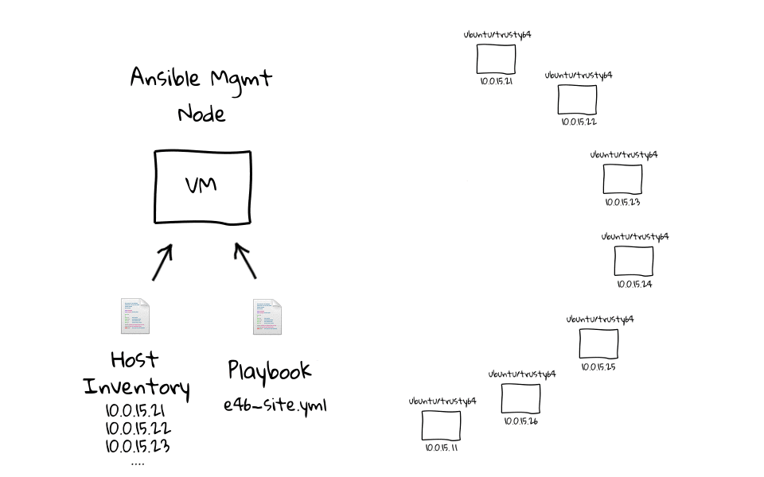
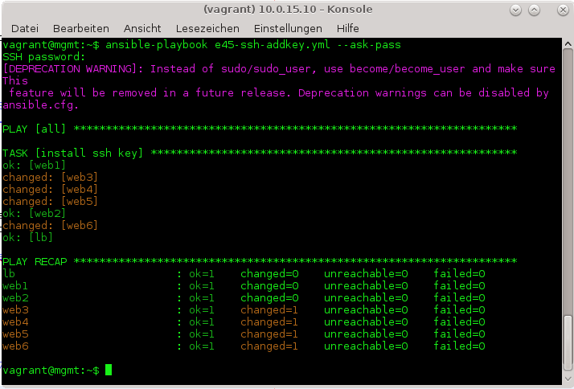
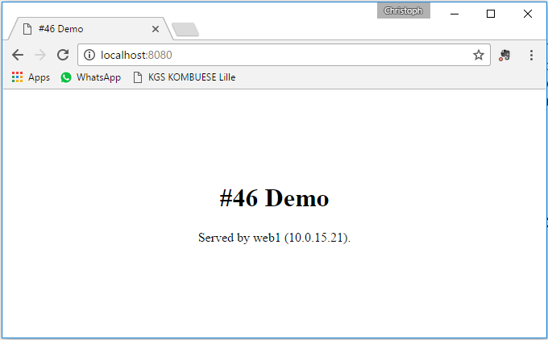
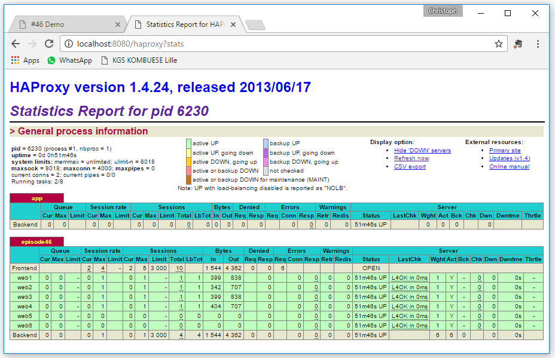

# Ansible

Ansible is an IT automation tool. It can configure systems, deploy software, and orchestrate more advanced IT tasks such as continuous deployments or zero downtime rolling updates.

See 

* [Ansible documentation](http://docs.ansible.com/ansible/index.html).
* [List of all Ansible modules](http://docs.ansible.com/ansible/list_of_all_modules.html).
* [19 minutes with ansible 1-4](https://sysadmincasts.com/episodes/43-19-minutes-with-ansible-part-1-4)
* [Best practices](http://docs.ansible.com/ansible/playbooks_best_practices.html)
* [Ansible and Docker](https://www.ansible.com/docker)

## Installation

If you are using RHEL/CentOS 6, 7, you have to enable *EPEL repository* (Extra Packages for Enterprise Linux) to install additional standard open source packages by using *yum* command. The EPEL configuration file is located under `/etc/yum.repos.d/epel.repo`. To verify the EPELrepo type `yum repolist`.

    $ wget http://dl.fedoraproject.org/pub/epel/7/x86_64/e/epel-release-7-8.noarch.rpm
    $ rpm -ivh epel-release-7-8.noarch.rpm

To install ansible simply type

    $ sudo yum install ansible -y

    [...]
    Installed:
      ansible.noarch 0:2.1.1.0-1.el7

    Dependency Installed:
      libtomcrypt.x86_64 0:1.17-23.el7          libtommath.x86_64 0:0.42.0-4.el7        python-httplib2.noarch 0:0.7.7-3.el7         python-keyczar.noarch 0:0.71c-2.el7
      python2-crypto.x86_64 0:2.6.1-9.el7       python2-ecdsa.noarch 0:0.13-4.el7       python2-paramiko.noarch 0:1.16.1-1.el7       sshpass.x86_64 0:1.05-5.el7

    Complete!

To verify the installation type

    $ ansible --version
    ansible 2.1.1.0
        config file = /etc/ansible/ansible.cfg
        configured module search path = Default w/o overrides

## Preparation

### Preparation (1: manually)

I used Oracle VirtualBox to create a small "CentOS 7 minimal" VM on my local system and cloned it twice. I also created a snapshot for each machines to reset them, when I want to reset them.

I configured a second network adapter for each vm. The IP addresses are:

* 10.2.2.21
* 10.2.2.22
* 10.2.2.23

#### start vm, login and create a user one every vm

    Using username "root".
    Last login: Wed Oct  5 18:24:58 2016 from 10.2.2.1
    [root@localhost ~]# useradd chwohlan

    [root@localhost ~]# passwd chwohlan
    Changing password for user chwohlan.
    New password:
    Retype new password:
    passwd: all authentication tokens updated successfully.
    
#### Prepare SSH keys to remote hosts

To perform any deployment or management from the localhost to remote host first we need to create and copy the ssh keys to the remote host.

Create the key

    $ ssh-keygen -t rsa -b 4096 -C "christoph.wohlan@t-systems.com"
    Generating public/private rsa key pair.
    Enter file in which to save the key (/home/chwohlan/.ssh/id_rsa):
    Enter passphrase (empty for no passphrase):
    Enter same passphrase again:
    Your identification has been saved in /home/chwohlan/.ssh/id_rsa.
    Your public key has been saved in /home/chwohlan/.ssh/id_rsa.pub.
    The key fingerprint is:
    a1:1a:94:74:f7:6b:69:66:07:cf:90:b8:72:e3:30:11 christoph.wohlan@t-systems.com
    The key's randomart image is:
    +--[ RSA 4096]----+
    |    . E .        |
    |   . o o o .     |
    |    o . o o      |
    |   .   o o B     |
    |    . = S B +    |
    |     o * o .     |
    |    .   .        |
    |                 |
    |                 |
    +-----------------+

#### Copy the key to remote hosts.

    $ ssh-copy-id chwohlan@10.2.2.21
    /usr/bin/ssh-copy-id: INFO: attempting to log in with the new key(s), to filter out any that are already installed
    /usr/bin/ssh-copy-id: INFO: 1 key(s) remain to be installed -- if you are prompted now it is to install the new keys
    chwohlan@10.2.2.21's password:

    Number of key(s) added: 1

    Now try logging into the machine, with:   "ssh 'chwohlan@10.2.2.21'"
    and check to make sure that only the key(s) you wanted were added.

#### Test the connection

    $ ssh chwohlan@10.2.2.21
    Last login: Wed Oct  5 18:12:29 2016 from 10.2.2.1
    $ logout
    Connection to 10.2.2.21 closed.

Create an Inventory File for Remote Hosts

#### Add your hosts IP addresses.

Add your hosts IP addresses to the `/etc/ansible/hosts` inventory file.

    [web-servers]
    10.2.2.21 web1
    10.2.2.22 web2
    10.2.2.23 web3

> See [Ansible Docs - Inventory](http://docs.ansible.com/ansible/intro_inventory.html).
   
### Preparation (2: using Vagrant)

see [learning-ansible-with-vagrant](https://sysadmincasts.com/episodes/45-learning-ansible-with-vagrant-part-2-4)

#### Create the vms

You need Vagrant, this `Vagrantfile`

    # Defines our Vagrant environment
    #
    # -*- mode: ruby -*-
    # vi: set ft=ruby :

    Vagrant.configure("2") do |config|

      # create mgmt node
      config.vm.define :mgmt do |mgmt_config|
          mgmt_config.vm.box = "ubuntu/trusty64"
          mgmt_config.vm.hostname = "mgmt"
          mgmt_config.vm.network :private_network, ip: "10.0.15.10"
          mgmt_config.vm.provider "virtualbox" do |vb|
            vb.memory = "256"
          end
          mgmt_config.vm.provision :shell, path: "bootstrap-mgmt.sh"
      end

      # create load balancer
      config.vm.define :lb do |lb_config|
          lb_config.vm.box = "ubuntu/trusty64"
          lb_config.vm.hostname = "lb"
          lb_config.vm.network :private_network, ip: "10.0.15.11"
          lb_config.vm.network "forwarded_port", guest: 80, host: 8080
          lb_config.vm.provider "virtualbox" do |vb|
            vb.memory = "256"
          end
      end

      # create some web servers
      # https://docs.vagrantup.com/v2/vagrantfile/tips.html
      (1..2).each do |i|
        config.vm.define "web#{i}" do |node|
            node.vm.box = "ubuntu/trusty64"
            node.vm.hostname = "web#{i}"
            node.vm.network :private_network, ip: "10.0.15.2#{i}"
            node.vm.network "forwarded_port", guest: 80, host: "808#{i}"
            node.vm.provider "virtualbox" do |vb|
              vb.memory = "256"
            end
        end
      end

    end

and this bootstrap (`bootstrap-mgmt.sh`) file:

    #!/usr/bin/env bash

    # install ansible (http://docs.ansible.com/intro_installation.html)
    apt-get -y install software-properties-common
    apt-add-repository -y ppa:ansible/ansible
    apt-get update
    apt-get -y install ansible

    # copy examples into /home/vagrant (from inside the mgmt node)
    cp -a /vagrant/examples/* /home/vagrant
    chown -R vagrant:vagrant /home/vagrant

    # configure hosts file for our internal network defined by Vagrantfile
    cat >> /etc/hosts <<EOL

    # vagrant environment nodes
    10.0.15.10  mgmt
    10.0.15.11  lb
    10.0.15.21  web1
    10.0.15.22  web2
    10.0.15.23  web3
    EOL

Then bring up the Ansible management node, the load balancer and a number of web servers by simply typing `vagrant up`.

#### connect to the management node

Connect to the Management Node by typing `vagrant ssh mgmt` or `ssh vagrant@10.0.15.10` or by using PuTTy or mRemoteNG to connect to 10.0.15.10. User:vagrant/vagrant.

#### generate and copy ssh key

Generate ssh RSA public and private keys

    ssh-keygen -t rsa -b 2048

Take a look

    ls -l .ssh/
    cat ~/.ssh/known_hosts

Use `e45-ssh-addkey.yml` playbook deploy local RSA public key for the Vagrant user to our remote client machines.

    vagrant@mgmt:~$ cat e45-ssh-addkey.yml
    ---
    - hosts: all
      sudo: yes
      gather_facts: no
      remote_user: vagrant

      tasks:

      - name: install ssh key
        authorized_key: user=vagrant 
                        key="{{ lookup('file', '/home/vagrant/.ssh/id_rsa.pub') }}" 
                        state=present

Run `e45-ssh-addkey.yml` playbook

    ansible-playbook e45-ssh-addkey.yml --ask-pass

### Do some checks using Ansible modules

#### ping

Let ansible [ping](http://docs.ansible.com/ansible/ping_module.html) our new *web-servers*.

    $ ansible -m ping web-servers
    10.2.2.21 | SUCCESS => {
        "changed": false,
        "ping": "pong"
    }
    10.2.2.22 | SUCCESS => {
        "changed": false,
        "ping": "pong"
    }
    10.2.2.23 | SUCCESS => {
        "changed": false,
        "ping": "pong"
    }

## Gettimg started

### Ad-hoc Shell Commands

Use the `command` module to check the partitions on all remote hosts.

    $ ansible -m command -a "df -h" web-servers
    
or to check the memory usage on all remote hosts.

    $ ansible -m command -a "free -mt" web-servers
    
or the uptime

    $ ansible -m command -a "uptime" web-servers
    or
    $ ansible -m shell -a "uptime" web-servers

or the server type

    $ ansible -m command -a "arch" web-servers
    or
    $ ansible -m shell -a "uname -a" web-servers

or the hostnames

    $ ansible -m shell -a "hostname" web-servers

or, maybe we want to reboot all the web nodes.
    
    $ ansible -m shell -a "/sbin/reboot" web-servers

Our management node is up and running, with a valid Ansible install, we have password less access into our client nodes, and we can run commands on the client nodes.

> To install midnight Commander on Ubuntu: `sudo apt-get install mc`.

### Ad-hoc commands to install and configure a package

This is just to illustrate how to install packages, deploy files, or restart services, as this workflow fits much better into Playbooks.

#### Installing a Package

In this example we run an ad-hoc ansible command using the apt package module on web1, to make sure the package with a name of [ntp](https://de.wikipedia.org/wiki/Network_Time_Protocol) is in the installed state. The --sudo option tells Ansible that it should run the apt-get command as root, so that the package will be installed correctly.

    $ ansible --sudo -m apt -a "name=ntp state=installed" web1

    web1 | SUCCESS => {
        "cache_update_time": 0,                          
        "cache_updated": false, 
        "changed": true,        
        "stderr": "",           
        "stdout": "Reading package lists...\nThe following extra packages will be installed:
        [...]
            " * Starting NTP server ntpd",
            "   ...done."
        ]
    }

> We are looking at the *apt* package module here, but this would be functionally the same using the *yum* module, if you were on a RHEL/CentOS/Fedora/Atomic machine.

#### Deploying a Configuration File

Lets deploy a configuration file, for the ntp service. The ntp.conf file is included in the files folder (`cat files/ntp.conf`).

    $ ansible web1 -m copy -a "src=/home/vagrant/files/ntp.conf dest=/etc/ntp.conf mode=644 owner=root group=root" --sudo

    web1 | SUCCESS => {
        "changed": true,
        "dest": "/etc/ntp.conf",
        "group": "root",
        [...]    
    }

This is a pretty common pattern for deploying application stacks to remote machines, install a bunch of packages, push out your configuration files, then restart the relevant services.

    $ ansible web1 -m service -a "name=ntp state=restarted"

    web1 | SUCCESS => {
        "changed": true,
        "name": "ntp",
        "state": "started"
    }

## Playbooks

[Playbooks](http://docs.ansible.com/ansible/playbooks.html) give you a way to bundle ad-hoc commands. Each playbook is composed of one or more *plays* in a list. The goal of a play is to map a group of hosts to some well defined roles, represented by things ansible calls *tasks*. At a basic level, a task is nothing more than a call to an *ansible module*.

> "There are multiple ways to organize playbooks and the files they include, and we’ll offer up some suggestions on that and making the most out of Ansible. It is recommended to look at [Example Playbooks](https://github.com/ansible/ansible-examples) while reading along with the playbook documentation."

Here’s a playbook that contains just one *play*:

    vagrant@mgmt:~$ cat ntp_install.yml
    ---
    - hosts: web1, web2, web3
      sudo: yes
      gather_facts: no

      tasks:

      - name: install ntp
        apt: name=ntp state=installed update_cache=yes

      - name: write our ntp.conf
        copy:
          src:   /home/vagrant/files/ntp.conf
          dest:  /etc/ntp.conf mode=644
          owner: root
          group: root
        notify: restart ntp

      - name: start ntp
        service: name=ntp state=started

      handlers:
      - name: restart ntp
        service: name=ntp state=restarted

By composing a playbook of multiple *plays*, it is possible to orchestrate multi-machine deployments, running certain steps on all machines in the webservers group, then certain steps on the database server group, then more commands back on the webservers group, etc.

Run the playbook with

    $ vagrant@mgmt:~$ ansible-playbook ntp_install.yml 

    PLAY [web1, web2, web3] ********************************************************

    TASK [install ntp] *************************************************************
    ok: [web2]
    ok: [web1]

    TASK [write our ntp.conf] ******************************************************
    changed: [web2]
    changed: [web1]

    TASK [start ntp] ***************************************************************
    ok: [web1]
    ok: [web2]

    RUNNING HANDLER [restart ntp] **************************************************
    changed: [web2]
    changed: [web1]

    PLAY RECAP *********************************************************************
    web1                       : ok=4    changed=2    unreachable=0    failed=0
    web2                       : ok=4    changed=2    unreachable=0    failed=0

## Facts

When an Ansible playbook run executes against a remote machine, a task will launch, and gather facts about that remote machine. These can be used for all types of things. 

We can run an ad-hoc version pipe the output into less like this:

    $ ansible web1 -m setup | less

We can pass a filter like this
    
    $ ansible web1 -m setup -a "filter=ansible_distribution*"

or this

    $ ansible web1 -m setup -a "filter=ansible_all_ipv4_addresses"

    web1 | SUCCESS => {
        "ansible_facts": {
            "ansible_all_ipv4_addresses": [
                "10.0.2.15",
                "10.0.15.21"
            ]
        },
        "changed": false
    }

## Templates and Variables

The idea of using templates for moving configuration out of the files is to add custom variables into the playbook, rather than digging through the configuration files.

vagrant@mgmt:~$ cat e45-ntp-template.yml
---
- hosts: all
  sudo: yes
  gather_facts: no
  vars:
    noc_ntpserver: server 0.ca.pool.ntp.org

  tasks:

  - name: install ntp
    apt: name=ntp state=installed update_cache=yes

  - name: write our ntp.conf
    template: src=/home/vagrant/files/ntp.conf.j2 dest=/etc/ntp.conf mode=644 owner=root group=root
    notify: restart ntp

  - name: start ntp
    service: name=ntp state=started

  handlers:

  - name: restart ntp
    service: name=ntp state=restarted

Here’s our playbook containing a *custom fact* or *variable* `noc_ntpserver` using a template file instead of copying a static configuration file.

    vagrant@mgmt:~$ cat ntp_install.yml
    ---
    - hosts: web1, web2, web3
      sudo: yes
      gather_facts: no      

      vars:
        noc_ntpserver: server 0.ca.pool.ntp.org

      tasks:

      - name: install ntp
        apt: name=ntp state=installed update_cache=yes

      - name: write our ntp.conf
        template:
          src:   /home/vagrant/templates/ntp.conf
          dest:  /etc/ntp.conf mode=644
          owner: root
          group: root
        notify: restart ntp

      - name: start ntp
        service: name=ntp state=started

      handlers:
      - name: restart ntp
        service: name=ntp state=restarted

Here's the template:

    vagrant@mgmt:~$ cat templates/ntp.conf.j2
    # {{ ansible_managed }}
    driftfile /var/lib/ntp/ntp.drift
    statistics loopstats peerstats clockstats
    filegen loopstats file loopstats type day enable
    filegen peerstats file peerstats type day enable
    filegen clockstats file clockstats type day enable
    server {{ noc_ntpserver }}
    restrict -4 default kod notrap nomodify nopeer noquery
    restrict -6 default kod notrap nomodify nopeer noquery
    restrict 127.0.0.1
    restrict ::1

Play the playbook and log into web1 (`ssh web1`) to have a peak at the /etc/ntp.conf file.

    vagrant@web1:~$ cat /etc/ntp.conf
    # Ansible managed: /home/vagrant/files/ntp.conf.j2 modified on 2016-10-06 16:19:27 by vagrant on mgmt
    driftfile /var/lib/ntp/ntp.drift
    [...]
    server server 0.ca.pool.ntp.org                                      <--
    restrict -4 default kod notrap nomodify nopeer noquery
    restrict -6 default kod notrap nomodify nopeer noquery
    restrict 127.0.0.1
    restrict ::1

## Create a load balanced web cluster

See [19 minutes with ansible 3/4](https://sysadmincasts.com/episodes/46-configuration-management-with-ansible-part-3-4)!

### Modifying The Environment

#### Add web3, web4, web5 and web6

Edit the Vagrantfile to bring up 6 web servers. Then edit the inventory.ini file on the Ansible management node and uncomment web three, four, five, and six.

#### Configure SSH Access

We used ssh-keyscan to acknowledge ssh fingerprint authenticity in bulk, and pipe these keys into the known_hosts file. Then, we deployed the vagrant users public RSA key out to these remote hosts, via the e45-ssh-addkey playbook.

    $ vagrant@mgmt:~$ ssh-keyscan web3 web4 web5 web6 >> .ssh/known_hosts
    $ ansible-playbook e45-ssh-addkey.yml --ask-pass

    $ ansible all -m ping

#### Playbook

The playbook is broken into 3 plays:

1. Common configuration across all nodes in our hosts inventory.
2. Install nginx and copy static web content on our web nodes.
3. Install and configure [haproxy](http://www.haproxy.org/).

    vagrant@mgmt:~$ cat e46-site.yml
    ---

    # common
    - hosts: all
      sudo: yes
      gather_facts: no

      tasks:

      - name: install git
        apt: name=git state=installed update_cache=yes

    # web
    - hosts: web
      sudo: yes

      tasks:

      - name: install nginx
        apt: name=nginx state=installed

      - name: write our nginx.conf
        template: src=templates/nginx.conf.j2 dest=/etc/nginx/nginx.conf
        notify: restart nginx

      - name: write our /etc/nginx/sites-available/default
        template: src=templates/default-site.j2 dest=/etc/nginx/sites-available/default
        notify: restart nginx

      - name: deploy website content
        template: src=templates/index.html.j2 dest=/usr/share/nginx/html/index.html

      handlers:

      - name: restart nginx
        service: name=nginx state=restarted

    # lb
    - hosts: lb
      sudo: yes

      tasks:

      - name: install haproxy and socat
        apt: pkg={{ item }} state=latest
        with_items:
        - haproxy
        - socat

      - name: enable haproxy
        lineinfile: dest=/etc/default/haproxy regexp="^ENABLED" line="ENABLED=1"
        notify: restart haproxy

      - name: deploy haproxy config
        template: src=templates/haproxy.cfg.j2 dest=/etc/haproxy/haproxy.cfg
        notify: restart haproxy

      handlers:

      - name: restart haproxy
        service: name=haproxy state=restarted

#### configuration files

    vagrant@mgmt:~$ ls -l templates/
    total 16
    -rw-r--r-- 1 vagrant vagrant  318 Feb  9 18:57 default-site.j2
    -rw-rw-r-- 1 vagrant vagrant 1243 Feb  9 17:58 haproxy.cfg.j2
    -rw-rw-r-- 1 vagrant vagrant  671 Feb 24 02:32 index.html.j2
    -rw-rw-r-- 1 vagrant vagrant  912 Feb  9 18:57 nginx.conf.j2

#### Pulling the Trigger

    $ ansible-playbook e46-site.yml     

    PLAY [all] *********************************************************************

    TASK [install git] *************************************************************
    changed: [web1]
    changed: [web2]
    changed: [web4]
    changed: [web3]
    changed: [web5]
    changed: [lb]
    changed: [web6]

    PLAY [web] *********************************************************************

    TASK [setup] *******************************************************************
    ok: [web1]
    ok: [web3]

    [...]

    PLAY RECAP *********************************************************************
    lb                         : ok=6    changed=5    unreachable=0    failed=0
    web1                       : ok=7    changed=6    unreachable=0    failed=0
    web2                       : ok=7    changed=6    unreachable=0    failed=0
    web3                       : ok=7    changed=6    unreachable=0    failed=0
    web4                       : ok=7    changed=6    unreachable=0    failed=0
    web5                       : ok=7    changed=6    unreachable=0    failed=0
    web6                       : ok=7    changed=6    unreachable=0    failed=0

In our Vagrantfile, which created this virtual Vagrant environment, we mapped port 8080 from the host machine, into the load balancer on port 80. So, when we connect to localhost 8080 on the host machine, it will be redirected into the Vagrant environment, to the load balancer on port 80.

## Roles

Roles allow you to move the configuration out of the playbook and into a file and directory structure, called a role. The entire goal of this, is to make things modular, so that you can share and reuse roles, along with not having playbooks that are thousands of lines long.

#### files

    $ sudo apt-get install tree

    $ tree roles\
    roles/
    ├── common
    │   └── tasks
    │       └── main.yml
    ├── lb
    │   ├── handlers
    │   │   └── main.yml
    │   ├── tasks
    │   │   └── main.yml
    │   └── templates
    │       └── haproxy.cfg.j2
    └── web
        ├── handlers
        │   └── main.yml
        ├── tasks
        │   └── main.yml
        └── templates
            ├── default-site.j2
            ├── index.html.j2
            └── nginx.conf.j2

#### playbook using roles

    vagrant@mgmt:~$ cat e46-role-site.yml
    ---

    # common
    - hosts: all
      sudo: yes
      gather_facts: no

      roles:
        - common

    # web
    - hosts: web
      sudo: yes

      roles:
        - web

    # lb
    - hosts: lb
      sudo: yes

      roles:
        - lb

#### tasks for role web

    vagrant@mgmt:~/roles/web/tasks$ ls
    main.yml
    vagrant@mgmt:~/roles/web/tasks$ cat main.yml
    ---
    - name: install nginx
      apt: name=nginx state=installed

    - name: write our nginx.conf
      template: src=nginx.conf.j2 dest=/etc/nginx/nginx.conf
      notify: restart nginx

    - name: write our /etc/nginx/sites-available/default
      template: src=default-site.j2 dest=/etc/nginx/sites-available/default
      notify: restart nginx

    - name: deploy website content
      template: src=index.html.j2 dest=/usr/share/nginx/html/index.html

For more about roles see Ansible documentation [Roles](http://docs.ansible.com/ansible/playbooks_roles.html).

## Suspend and resume, halt, destroy VMs

We have created a management node, a load balancer and 6 web servers.

Simply `# vagrant suspend` and `# vagrant resume` later on.

You can `# vagrant halt` to shut down gracefully.

After running `# vagrant destroy`, your computer should be left at a clean state, as if you never created the guest machine in the first place.
 
See [Commands](https://www.vagrantup.com/docs/cli/)
   
# Backup
## Ansible and Docker

### Install pip and docker-compose

Pip is part of Extra Packages for Enterprise Linux ([EPEL](https://fedoraproject.org/wiki/EPEL), which is a community repository of non-standard packages for the RHEL distribution.

    $ rpm -iUvh https://dl.fedoraproject.org/pub/epel/7/x86_64/e/epel-release-7-8.noarch.rpm
    $ yum -y update

Having EPEL installed simply type

    $ yum -y install python-pip

    $ pip install 'docker-py>=1.7.0'
    $ pip install 'docker-compose>=1.7.0'

