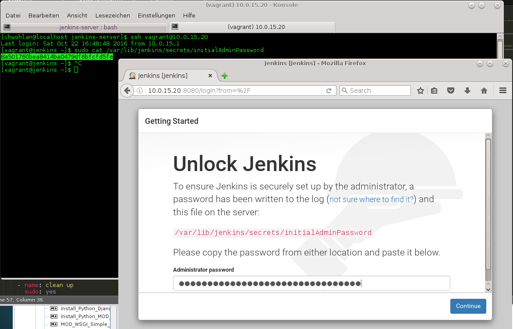

# Jenkins

[Jenkins](https://jenkins.io/) is an automation engine with an unparalleled plugin ecosystem to support all of your favorite tools in your delivery pipelines, whether your goal is continuous integration, automated testing, or continuous delivery. 

## Installation

[Vagrant](https://www.vagrantup.com/docs/installation/) allows us to create reproducible environments, making it really easy to work with virtual machines. [Ansible](http://docs.ansible.com/ansible/index.html) is an infrastructure automation platform that makes it easy to manage and configure your servers.

### Create a virtual machine

Use Vagrant to bring up a [CentOS 7](https://atlas.hashicorp.com/centos/boxes/7) VM for Oracle VirtualBox on Windows 10.

Create a folder `jenkins-server` and type `vagrant init Centos/7`.

Modifiy the Vagrantfile:

    # -*- mode: ruby -*-
    # vi: set ft=ruby :

    Vagrant.configure("2") do |config|
      # For a complete reference, please see the online documentation at
      # https://docs.vagrantup.com.

      # Every Vagrant development environment requires a box. You can search for
      # boxes at https://atlas.hashicorp.com/search.
      config.vm.box = "centos/7"

      config.vm.hostname = "jenkins-server"
      config.vm.network "private_network", ip: "10.0.15.20"

      config.vm.provider "virtualbox" do |vb|
        vb.gui = true
        vb.name="Jenkins-Server"
        vb.memory = "1024"
      end

    end

Type `vagrant up`.

Login into the vm with `vagrant/vagrant`.

For a german keyboard layout type 

    sudo loadkeys de

If you get a "`Disconnected: No supported authentication methods available (server sent: publickey)`" error message, then turn on Password Authentication: edit the `/etc/ssh/sshd_config` file and change `PasswordAuthentication` and `ChallengeResponseAuthentication` to `yes` and restart (`shutdown -r now`). Don't do that in production!

#### Copy public ssh key and ssh login

Login to your your Ansible management node and copy your public key to the jenkins-server. 

    $ ssh-copy-id vagrant@10.0.15.20

If you run into `Host key verification failed...` problems, try `ssh-keygen -R 10.0.15.20` to remove the host key of the remote host.

Now you can connect to the remote with `ssh vagrant@10.0.15.20` or use Ansible to install software.

### Install Jenkins using Ansible

See also 

* [Installing Jenkins on Red Hat distributions](https://wiki.jenkins-ci.org/display/JENKINS/Installing+Jenkins+on+Red+Hat+distributions).
* [Ansible playbook: Jenkins](https://github.com/ICTO/ansible-jenkins)

Create new folder for the playbook. Create a local inventory file (`hosts`) and add the IP address of the jenkins-server.

    [jenkins-server]
    10.0.15.20 ansible_ssh_pass=vagrant ansible_ssh_user=vagrant

If don't use ssh keys, you can add `ansible_ssh_pass=vagrant ansible_ssh_user=vagrant`

This is the (all in one) `setup.yml` playbook:

    ---
    #
    # Setup a Jenkins 2.0 server
    #

    - name: install Java 
      hosts: jenkins-server

      vars:

        java_version: 8u111
        java_subversion: 8u111-b14
        java_foldername: jdk1.8.0_111
        target_folder: /opt
        download_file: jdk-{{ java_version }}-linux-x64.tar.gz
        download_url: "http://download.oracle.com/otn-pub/java/jdk/{{ java_subversion }}/{{ download_file }}"
        java_archive: "{{ target_folder }}/{{ download_file }}" 
        java_folder: "{{ target_folder }}/{{ java_foldername }}"

      tasks:

        - name: check if java_folder exists
          stat: path={{ java_folder }}
          register: path_java_folder

        - name: download java_archive
          sudo: yes      
          get_url:
            url: "{{ download_url }}"
            dest: "{{ java_archive }}"
            headers: "Cookie: gpw_e24=http%3A%2F%2Fwww.oracle.com%2F; oraclelicense=accept-securebackup-cookie"
            force: no
          when: path_java_folder.stat.exists == False 

        - name: unarchive java_archive into java_folder
          sudo: yes
          unarchive:
            src: "{{ java_archive }}"
            dest: "{{ target_folder }}"        
            copy: no        
          when: path_java_folder.stat.exists == False

        - name: fix ownership
          sudo: yes
          file: state=directory path={{ java_folder }} owner=root group=root recurse=yes

        - name: make Java available for system
          sudo: yes
          command: 'alternatives --install "/usr/bin/java" "java" "{{java_folder}}/bin/java" 2000'

        - name: clean up
          sudo: yes
          file: state=absent path={{ java_archive }}

    - name: install Jenkins 2
      hosts: jenkins-server

      vars:

        jenkins_repo_source: http://pkg.jenkins-ci.org/redhat/jenkins.repo
        jenkins_repo_dest: /etc/yum.repos.d/jenkins.repo
        jenkins_repo_key: https://jenkins-ci.org/redhat/jenkins-ci.org.key
    
      tasks:

        - name: download jenkins repo
          sudo: yes
          get_url:
            url: "{{ jenkins_repo_source }}"
            dest: "{{ jenkins_repo_dest }}"
            force: no

        - name: import key
          sudo: yes
          rpm_key: state=present key="{{ jenkins_repo_key }}"

        - name: install jenkins
          sudo: yes
          yum: name=jenkins state=present

        - name: enable and start
          sudo: yes
          service: name=jenkins enabled=yes state=started

    - name: setup Maven
      hosts: jenkins-server

      tasks:

        - name: install Maven
          yum: name=maven state=present

Run the playbook:

    $ ansible-playbook setup.yml -i hosts -vv

Open the Jenkins console (`http://10.0.15.20:8080`) and unlock Jenkins. 

### Plugins

To install Plugins from the [Jenkins cli](http://10.0.15.20:8080/cli/) you need to download the JAR file for the Jenkins client from the URL "/jnlpJars/jenkins-cli.jar" on your Jenkins server (e.g. http://10.0.15.20:8080/jnlpJars/jenkins-cli.jar). You can place it in you `/usr/lib/jvm/lib/ext`folder.

To run a cli command:

    $ java -jar jenkins-cli.jar [-s JENKINS_URL] command [options...] [arguments...]

**...to be continued!**

### Further reading

* [Jenkins](https://jenkins.io/)
* [Jenkins Tutorial](http://www.vogella.com/tutorials/Jenkins/article.html)
* [Jenkins 2 Tutorial For Beginners – Getting Started Guide](http://devopscube.com/jenkins-2-tutorials-getting-started-guide/)
* [How to Setup Slaves on Jenkins 2.0 Using Password and ssh Keys](http://devopscube.com/setup-slaves-on-jenkins-2/)
* [Pipeline as code with Jenkins](https://jenkins.io/solutions/pipeline/)

### Jenkins and Openshift

* [Configure an external Jenkins with slaves on Openshift](https://blog.openshift.com/jenkins-slaves-in-openshift-using-an-external-jenkins-environment/)
* [Deploy applications to OpenShift 3 using Jenkins](https://blog.openshift.com/deploy-applications-openshift-3-using-jenkins/)
* [Creating a Jenkins Cluster in OpenShift](http://blog.andyserver.com/2016/01/jenkins-cluster-openshift/)
* [Dynamic Jenkins Slave Provisioning on OpenShift(]http://blog.andyserver.com/2016/01/dynamic-jenkins-slave-provisioning-on-openshift/)
