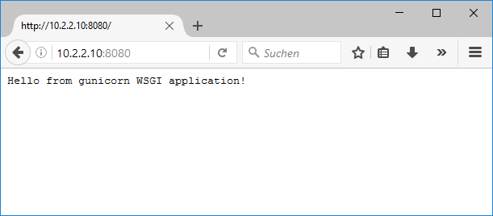
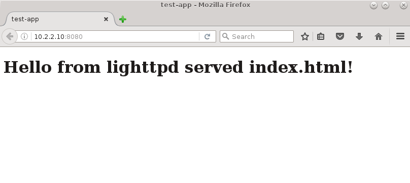
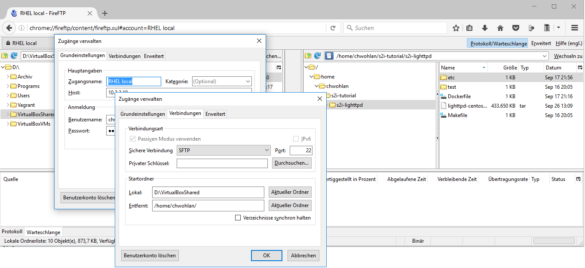

# Openshift

## S2I - Source to image

### Introduction

Source-to-Image (S2I) is a framework that makes it easy to write reproducible Docker images that take application source code as an input and produce a new image that runs the assembled application as output.
See [OSE 3.1 - Creating Images - S2I Requirements](https://docs.openshift.com/enterprise/3.1/creating_images/s2i.html#creating-images-s2i)

> Note that, similarly to Red Hat Software Collections container images, using the S2I tool is supported only on Red Hat Enterprise Linux 7 Server. You cannot run the tool on Red Hat Enterprise Linux 7 Workstation.

### Installation

The s2i tool runs on Red Hat Enterprise Linux 7 or grater and needs Docker to be installed.

#### Install RHEL 7

If you have a Red Hat subscription, you can download ISO image files of the Red Hat Enterprise Linux 7 installation DVD from the Red Hat Customer Portal. If you do not have a subscription, either purchase one or obtain a free evaluation subscription from the Software & Download Center at https://access.redhat.com/downloads/.

See [DOWNLOADING RED HAT ENTERPRISE LINUX](https://access.redhat.com/documentation/en-US/Red_Hat_Enterprise_Linux/7/html/Installation_Guide/chap-download-red-hat-enterprise-linux.html)

Once you have RHEL 7.x installed in a VM on Oracle VirtualBox, you have to register your copy. 

    $ sudo subscription-manager --force register    
    Registering to: subscription.rhn.redhat.com:443/subscription
    Username: tsi-appfabric-ccp
    Password: xxxxxx
    The system has been registered with ID: 23e9xxxx-xxxx-xxxx-xxxx-xxxxxxxx0fb8

You can list the available subscriptions with the following command

    sudo subscription-manager list --available
    +-------------------------------------------+
        Available Subscriptions
    +-------------------------------------------+    

    ...

    Subscription Name:   Red Hat OpenShift Enterprise for Providers Enablement (Diagnostic - only)
    Provides:            Red Hat JBoss Core Services
                         ...                         
                         Red Hat Enterprise Linux Server
    SKU:                 MCT3009
    Contract:            1xxxxxx4
    Pool ID:             8a85xxxxxxxxxxxxxxxxxxxxxxxx0cc2
    ...

Look for "Red Hat OpenShift Enterprise for Providers" and attach with the `Pool ID`. 

    $ sudo subscription-manager attach --pool 8a85xxxxxxxxxxxxxxxxxxxxxxxx0cc2
    Successfully attached a subscription for: Red Hat OpenShift Enterprise for Providers Enablement (Diagnostic - only)

Run "yum repolist all" to see the repos you have.   
You can enable repos with yum-config-manager --enable <repo>

> Next I would `yum update` and then configure ssh to connect via mRemoteNG.

#### Install Docker

[This page](https://docs.docker.com/engine/installation/linux/rhel/) instructs you on how to install Docker on RHEL.

Add the yum repo

    $ sudo tee /etc/yum.repos.d/docker.repo <<-EOF
    [dockerrepo]
    name=Docker Repository
    baseurl=https://yum.dockerproject.org/repo/main/centos/7
    enabled=1
    gpgcheck=1
    gpgkey=https://yum.dockerproject.org/gpg
    EOF

and install Docker.

    $ sudo yum install docker-engine

Then start the Docker daemon.
    
    $ sudo chkconfig docker on
    $ sudo service docker start

Run the hello-world test image in a container.

    $ sudo docker run hello-world

To avoid having to use sudo when you use the docker command, create a Unix group called docker and add users to it. Reboot!

    $ sudo groupadd docker
    $ sudo usermod -aG docker [your_username]
    
    $ shutdown -r now
 
#### Install S2I

Download an extract s2i from [openshift/source-to-image releases](https://github.com/openshift/source-to-image/releases)

    $ curl -sL https://github.com/openshift/source-to-image/releases/download/v1.1.1/source-to-image-v1.1.1-724c0dd-linux-386.tar.gz | tar xz

and copy s2i and sti to /usr/bin.

## Getting started

[OSE 3.1 / Architecture / Core Concepts / Builds and Image Streams](https://docs.openshift.com/enterprise/3.1/architecture/core_concepts/builds_and_image_streams.html#source-build) gives an overview over the OpenShift build system and the three build strategies available.

[Overview - Using images](https://docs.openshift.com/enterprise/3.1/using_images/index.html) lets you discover the different S2I (Source-to-Image), database, and other Docker images that are available for OpenShift Enterprise users.
 
In [this OpenShift Commons Briefing video](https://blog.openshift.com/source-image-s2i-deep-dive-ben-parees-openshift-commons-briefing-43/), Ben Parees, lead developer at Red Hat on Source-to-Image (S2I) project, explains how Source-to-Image works and gives a deep technical into the anatomy of S2I Builder Images along with a step-by-step demonstrations on a number of the different workflows for creating enterprise-ready reusable images.

### Example: building a Python application from Git using S2I

[Using Red Hat Software Collections Container Images](https://access.redhat.com/articles/1752723) provides instructions for obtaining, configuring, and using container images that are shipped with Red hat Software Collections.

The [Python Docker images](https://github.com/openshift/sti-python.git) repository contains the source for building various versions of the Python application as a reproducible Docker image using source-to-image. Users can choose between RHEL and CentOS based builder images. The resulting image can be run using Docker.

Pull the builder image:

    $ docker pull registry.access.redhat.com/rhscl/python-34-rhel7

Build the test application from the GitHub sti-python repository, underneath the 3.4/test/setup-test-app/ directory:

    $ s2i build https://github.com/openshift/sti-python.git --context-dir=3.4/test/setup-test-app/ registry.access.redhat.com/rhscl/python-34-rhel7 python-34-rhel7-app

Run the resulting python-34-rhel7-app image:

    $ docker run -d -p 8080:8080 --name example-app python-34-rhel7-app

Fetch a document from the container (using the ip address of your local RHEL7 VM)

Stop the container

    $ docker stop example-app

### Create an S2I Builder Image

[How to Create an S2I Builder Image](https://blog.openshift.com/create-s2i-builder-image/) is about creating a simple S2I builder image, that can consume html files in a git repository and produce a new image that will serve those html files when run.

Source-To-Image, as the name implies, is responsible for transforming your application source into an executable Dockerimage that you can later run inside of OpenShift 3.

The builder image contains the specific intelligence required to produce that executable image.

There is some required content of the builder image to make all this work. First of all, since the builder image is responsible for actually building the application, it has to contain all the necessary libraries and tools needed to build and run an application. 

Secondly, it needs to contain the script logic to actually perform the build and run operations.  This part is handled by the two required S2I Scripts:

1. assemble – which is responsible for the build of an application
2. run – which is responsible for running the application.

#### Step 1 - create directory structure

S2I comes with a handy command that bootstraps the required directory structure for a builder image.

    $ s2i create lighttpd-centos7 s2i-lighttpd

The result of running the above command is the following directory structure:

`s2i-lighttpd/`

* `Dockerfile` – This is a standard Dockerfile where we’ll define the builder image
* `Makefile` – a helper script for building and testing the builder image
* `test/`
    * `run` – test script, testing if the builder image works correctly
    * `test-app/` – directory for your test application
* `.s2i/bin/`
    * `assemble` – script responsible for building the application
    * `run` – script responsible for running the application
    * `save`-artifacts – script responsible for incremental builds, covered in a future article
    * `usage` – script responsible for printing the usage of the builder image

> Hint: `$  ls -al .*` shows the hidden .s2i folder

#### Step 2 - Dockerfile

The Dockerfile

    FROM openshift/base-centos7
    MAINTAINER Your Name <youremail@gmail.com>

    # the software version used
    ENV LIGHTTPD_VERSION=1.4.35

    # set labels used in OpenShift
    LABEL io.k8s.description="Platform for serving static HTML files" \
          io.k8s.display-name="Lighttpd 1.4.35" \
          io.openshift.expose-services="8080:http" \
          io.openshift.tags="builder,html,lighttpd"

    # install lighttpd
    RUN yum install -y lighttpd \
     && yum clean all -y

    # location of the S2I (repeated here to make clear)
    LABEL io.openshift.s2i.scripts-url=image:///usr/local/s2i

    # the S2I scripts
    COPY ./.s2i/bin/ /usr/local/s2i

    # the lighttpd configuration file
    COPY ./etc/ /opt/app-root/etc

    # Drop the root user and make the content of /opt/app-root owned by user 1001
    RUN chown -R 1001:1001 /opt/app-root

    # Set the default user for the image, the user itself was created in the base image
    USER 1001

    # expose port
    EXPOSE 8080

    # Set the default CMD to print the usage of the image, if somebody does docker run
    CMD ["usage"]

#### Step 3.1 - assemble

`assemble` is responsible for building the application. In this case it'll just copy the source files into the directory from which they will be served by the Lighttpd server.

    #!/bin/bash -e
    # S2I assemble script for the 'lighttpd-centos7' image.
    
    [...]

    echo "---> Installing application source"
    cp -Rf /tmp/src/. ./

    echo "---> Building application from source..."
    # nothing to do

By default the s2i build places the application source and other assets in the /tmp/src directory. The destination `./` is using the working directory `/opt/app-root/src` set in the openshift/base-centos7 image.

#### Step 3.2 - run

`run` is responsible for running the application.

    #!/bin/bash -e    
    # S2I run script for the 'lighttpd-centos7' image.

    exec lighttpd -D -f /opt/app-root/etc/lighttpd.conf

#### Step 3.3 - save-artifacts

Since we are not covering incremental builds in our example, we can safely remove the `save-artifacts` script. 

#### Step 3.4 - usage

Finally we put some information on how to use our builder image in the usage script:

    #!/bin/bash -e

    cat <<EOF
    This is the lighttpd-centos7 S2I image:
    To use it, install S2I: https://github.com/openshift/source-to-image

    Sample invocation:

    s2i build https://github.com/soltysh/sti-lighttpd.git --context-dir=test/test-app/ lighttpd-centos7 sample-app

    You can then run the resulting image via:
    docker run -p 8080:8080 sample-app
    EOF

#### Step 4 - lighttpd.conf

The last remaining piece of our builder image is the configuration file for Lighttpd: `s2i-lighttpd/etc/lighttpd.conf`:

    # directory where the documents will be served from
    server.document-root = "/opt/app-root/src"

    # port the server listens on
    server.port = 8080

    # default file if none is provided in the URL
    index-file.names = ( "index.html" )

    # configure specific mimetypes, otherwise application/octet-stream will be used for every file
    mimetype.assign = (
      ".html" => "text/html",
      ".txt" => "text/plain",
      ".jpg" => "image/jpeg",
      ".png" => "image/png"
    )

#### Step 5.1 - build builder image

Our builder image is ready. We can make sure it's being built properly by invoking the `make` command in the `s2i-lighttpd` directory which, as you can see from the Makefile, invokes a plain docker build command.

    $ make

    docker build -t lighttpd-centos7 .
    Sending build context to Docker daemon 15.87 kB
    Step 1 : FROM openshift/base-centos7
    latest: Pulling from openshift/base-centos7
    8d30e94188e7: Pull complete
    [...]
    Step 12 : CMD usage
    ---> Running in 255081f5a4ee
    ---> 8ea2f166f52b
    Removing intermediate container 255081f5a4ee
    Successfully built 8ea2f166f52b

#### Step 5.2 - test builder image

Now it’s time to test our builder image with a sample application. 

Create an `index.html` file in the `s2i-lighttpd/test/test-app` directory:

    <!doctype html>
    <html>
      <head>
        <title>test-app</title>
      </head>
    <body>
      <h1>Hello from lighttpd served index.html!</h1>
    </body>

With this file in place, we can now do our first S2I build. Let’s invoke the following command from the s2i-lighttpd directory:

    $ s2i build test/test-app/ lighttpd-centos7 sample-app

    ---> Installing application source...
    ---> Building application from source...

#### Step 6 - tests

The generated `s2i-lighttpd/test/run` script can be used as is from thes2i-lighttpd directory:

    $ make test

> NOTE: Make sure to check the test/run file permissions; it should be 700.

This script runs the s2i build (make sure to have the s2i executable in your PATH) using test-app as an application source and then performs a series of tests to make sure the image is usable. These tests include:

* checking that the s2i build finished with no errors,
* checking that the usage script is working as expected,
* running the resulting image,
* checking that the running application container responds properly.

### Move the builder image

#### Push the image to the Docker Hub

Docker Hub repositories let you share images with co-workers, customers, or the Docker community at large. If you’re building your images internally, you can push them to a Docker Hub repository with `docker push <hub-user>/<repo-name>:<tag>`. See [Your Hub repositories](https://docs.docker.com/docker-hub/repos/).

    # docker login --username=chwohlan
    Password:
    Email: chwohlan@gmail.com
    WARNING: login credentials saved in /root/.docker/config.json
    Login Succeeded

See [Tag, push, and pull your image](https://docs.docker.com/engine/getstarted/step_six/)

Interested in installing a [local Docker registry](https://docs.docker.com/registry/)?

#### using Docker save

To move a Docker image from one machine to another without using a repository you can save the image to a tar file via `docker save -o <save image to path> <image name>`.

    $ sudo docker save -o lighttpd-centos7.tar lighttpd-centos7
    $ sudo chmod 644 lighttpd-centos7.tar
    $ ls -l
    -rwxr--r--. 1 root     root     444057600 Sep 26 13:09 lighttpd-centos7.tar

then copy the file via `scp <source> <user@host:target>`

    $ sudo scp -r lighttpd-centos7.tar vagrant@10.2.2.2:~/
    vagrant@10.2.2.2's password:
    lighttpd-centos7.tar   
    
You can also ssh to the target and do it otherway round

    $ ssh vagrant@10.2.2.2
    vagrant@10.2.2.2's password:
    Last login: Sat Aug 27 20:59:19 2016 from 10.2.2.10
    [vagrant@localhost ~]$ sudo scp -r chwohlan@10.2.2.10:/home/chwohlan/s2i-tutorial/s2i-lighttpd/lighttpd-centos7.tar ~/
    
Or you can open Firefox and use FireFTP:

and finally load the file back again into docker via `docker load -i <path to image tar file>`.

    $ sudo docker load -i lighttpd-centos7.tar

    $ docker images
    REPOSITORY                                            TAG                 IMAGE ID            CREATED                  SIZE
    lighttpd-centos7                                      latest              8ea2f166f52b        Less than a second ago   429.1 MB
    [...]
